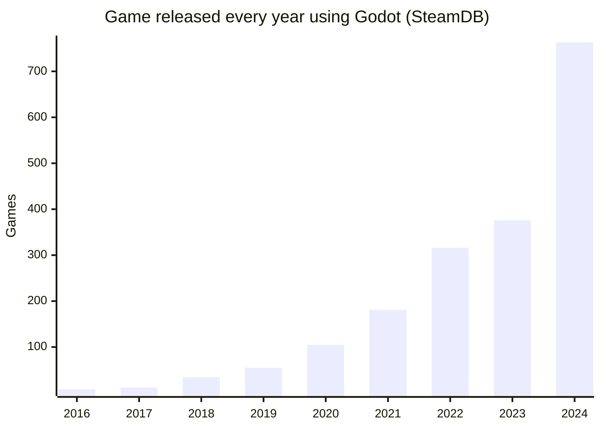

---
# You can also start simply with 'default'
theme: seriph
background: https://godotengine.org/assets/home/features/cross-platform.svg
# some information about your slides (markdown enabled)
title: Godot — the friendly open‑source game engine
info: |
  A practical overview of Godot for newcomers and hobbyist developers:
  - What is Godot?
  - Why it’s becoming so popular
  - Why it’s great for hobbyists
  - Advantages of an open‑source engine
  References included.
# apply unocss classes to the current slide
class: text-center
# https://sli.dev/features/drawing
drawings:
  persist: false
# slide transition: https://sli.dev/guide/animations.html#slide-transitions
transition: slide-left
---

# Godot

The friendly open‑source game engine

<div @click="$slidev.nav.next" class="mt-12 py-1" hover:bg="white op-10">
  Press Space for next page <carbon:arrow-right />
</div>

<div class="abs-br m-6 text-xl">
  <button @click="$slidev.nav.openInEditor()" title="Open in Editor" class="slidev-icon-btn">
    <carbon:edit />
  </button>
  <a href="https://github.com/geowarin/pres-godot" target="_blank" class="slidev-icon-btn">
    <carbon:logo-github />
  </a>
</div>

---

<SlidevVideo autoplay controls>
  <source src="/godot-showcase.webm" type="video/webm" />
  <p>
    Your browser does not support videos. You may download it
    <a href="/myMovie.mp4">here</a>.
  </p>
</SlidevVideo>

---

<Toc text-sm minDepth="1" maxDepth="2" />

---

# About me

In love with godot and game development. 😍

- 4 bug reports leading to fixes
- 7 PR merged
- 3 implemented proposals

I've been developing (bad) games for 20 years.

<div class="flex justify-center gap-4 h-50 mt-4">
    
    
    
    
</div>

https://geowarin.itch.io

---

# What Godot is

- A fully featured, free, open‑source 2D/3D game engine with an all‑in‑one lightweight editor.
- Broad platform support for development and deployment: Windows, macOS, Linux, Android, iOS, Web, XR (Quest/Horizon
  OS), and consoles (Switch, Xbox, PS5).
- Architecture: user‑facing “scenes and nodes” on top of high‑performance “servers” (data‑oriented systems for
  rendering, physics, etc.).
- Scripting: GDScript (tight integration), C# (high performance but historically less tightly integrated), and
  GDExtension bindings for many languages (C++, Rust, Go, Python, JavaScript).
- Notable tech: Jolt Physics integrated in 4.4; flexible modern rendering (forward+ hybrid, real‑time GI, scalable
  low‑end renderer); strong i18n including full RTL support.

<div class="flex justify-center">
  
</div>

<!--
Jolt: Horizon Forbidden West
-->

---

# Godot unfair advantages

- Very light: 120Mbc
    - Unreal: 35Gb
    - [Unity](https://youtu.be/5Sw2WcRqk2Y): 10Gb + Launcher + mandatory account
- Free forever
- Open source
- Modular & well architected
- Intuitive scene system
- Hot reloading and integrated debugger

<!--
Rapid iteration time
-->

---

# Free & Open Source

- Transparency: inspect [source](https://github.com/godotengine/godot), understand internals, learn from it
- Control: fix bugs, fork, or extend without waiting
- Community: [proposals](https://github.com/godotengine/godot-proposals/), [contributions](https://docs.godotengine.org/en/stable/contributing/index.html), add‑ons, and peer support
- Longevity: projects aren’t tied to a vendor’s business model
- Licensing clarity: permissive [MIT license](https://godotengine.org/license), no royalties
- [Godot foundation](https://godot.foundation/)

<!--
Previously associated with Software Freedom Conservancy (SFC)
-->

---

# Modular & Well Architected

- [Strong guidelines](https://docs.godotengine.org/en/stable/contributing/development/best_practices_for_engine_contributors.html) allowing thousands of contributors
- [Addons](https://godotengine.org/asset-library/asset) extend the engine with new features (gdscript, C#)
- Engine is [modular](https://docs.godotengine.org/en/stable/contributing/development/compiling/optimizing_for_size.html#disabling-unwanted-modules) (can be compiled without 3D for example)
- [GDExtension](https://docs.godotengine.org/en/stable/tutorials/scripting/gdextension/what_is_gdextension.html) allows writing C/C++ modules without engine forks
    - Terrain support
    - Language
      bindings ([D](https://github.com/godot-dlang/godot-dlang), [Go](https://github.com/grow-graphics/gd), [Nim](https://github.com/godot-nim/gdext-nim), [Rust](https://github.com/godot-rust/gdext), [Swift](https://github.com/migueldeicaza/SwiftGodot), [Odin](https://github.com/dresswithpockets/odin-godot),
      etc.)
- Godot is written "in godot"

---

# The Scene Tree

<div class="float-right">
  
</div>

- Games are built from scenes composed of nodes arranged in a tree.
- Each node provides a focused responsibility (e.g., Sprite2D, Area3D, AnimationPlayer).
- Focus on composition: reuse via instancing scenes as children of others.
- Signals decouple communication between nodes (event-driven).

---
layout: image-right
image: /PRs.png
---

# Godot popularity — by the numbers

- 100,000+ GitHub stars milestone reached (71 most starred on GH) [[1]](https://godotengine.org/article/beyond-100000-you-re-breathtaking/)
- 2,800+ code contributors over the project’s lifetime [[2]](https://github.com/godotengine/godot/issues/100000)
- Approx. 600 new pull requests and 600 new issues per month (sustained
  pace) [[1]](https://godotengine.org/article/beyond-100000-you-re-breathtaking/)

<div class="mt-6 inline-flex flex-col gap-4 grow-0">
  
  
  
</div>

<!--
Notes:
- Stars indicate community traction; badges auto-update.
- The ~600 PRs/month figure shows sustained contributor activity.
-->

---

# Adoption and momentum

- Unity's [controversial pricing changes](https://gamefromscratch.com/unity-announce-new-pricing-and-plan-changes/) in 2023 (since then canceled)
- Now appearing in industry surveys; projected significant growth this decade.
- Revenue traction: >$1M Godot games growing; cumulative revenues nearing $100M with strong YoY growth.
- Signals of industry trust: established studios [migrating projects](https://gamefromscratch.com/developer-experiences-moving-to-godot-from-unity/) and catalogs to Godot.
- Influencers:
    - [Brackeys](https://www.youtube/@Brackeys)
    - [Passivestar](https://bsky.app/profile/passivestar.bsky.social)
    - [Acerola](https://www.youtube/@Acerola_t)
    - [Kenney](https://kenney.nl/)

---

# Growth

<div class="mt-6 flex gap-4 grow-0">

<div class="flex flex-col">


Godot is the fastest growing game engine by far with a YoY growth of 100%.
</div>


</div>

---

# Demo: Bouncing balls!

- Floor is a [CSGShape3D](https://docs.godotengine.org/en/stable/tutorials/3d/csg_tools.html)


- Root is a [RigidBody3D](https://docs.godotengine.org/en/stable/classes/class_rigidbody3d.html)
    - Contains a [MeshInstance3D](https://docs.godotengine.org/en/stable/classes/class_meshinstance3d.html)
    - Contains a [CollisionShape3D](https://docs.godotengine.org/en/stable/classes/class_collisionshape3d.html)

- Make it a scene
- Add a lot of balls!

---

## Customize the ball color

```gdscript
extends RigidBody3D

@export var color: Color = Color(1, 0, 0)

func _ready() -> void:
    var material = StandardMaterial3D.new()
    material.albedo_color = color
    $Mesh.material_override = material

```

---

## Edit color in the editor

- add `@tool` to the script
- create a setter

```gdscript
@tool
extends RigidBody3D

@export var color: Color = Color(1, 0, 0):
	set(value):
		color = value
		var material = StandardMaterial3D.new()
		material.albedo_color = color
		$Mesh.material_override = material
```

---

## Add a button to create balls

```gdscript
@tool
extends Node3D

@export_tool_button("Add Ball", "Add") var add_ball_button = add_ball

func add_ball():
	var ball_scene = load("res://ball.tscn")
	var ball_instance = ball_scene.instantiate()
	ball_instance.color = Color.from_ok_hsl(randf(), 1, 0.5)
	ball_instance.position = Vector3(randf_range(-4, 4), randf_range(1, 5), randf_range(-4, 4))
	add_child(ball_instance, true)
	ball_instance.owner = get_tree().edited_scene_root
```

---

## Inspect the godot editor with godot!

<kbd>Debug</kbd> > <kbd>Customize run instances</kbd>

Main run args:

```
--path ../demo --editor
```

<div class="flex justify-center">
    
</div>

---

# Future

- 4.5 release (currently RC1)
- Each release introduces a massive amount of features (ex: [4.4 changelog](https://godotengine.org/releases/4.4/))
- [New asset store](https://store-beta.godotengine.org/)
- [Priorities](https://godotengine.org/priorities/)

[Is it time to use Godot?](https://passivestar.xyz/posts/is-it-time-to-use-godot/)

---

# References and further reading

- Website: https://godotengine.org
- Documentation: https://docs.godotengine.org
- Priorities: https://godotengine.org/priorities/
- Showcase: https://godotengine.org/showcase
- Asset Library: https://godotengine.org/asset-library
- Learn (Tutorials): https://docs.godotengine.org/en/stable/getting_started/step_by_step/index.html

<PoweredBySlidev mt-10 />
